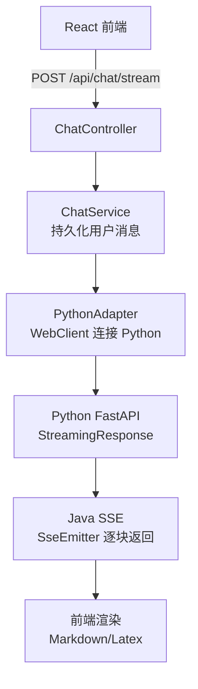

# java-backend 架构说明（MVP）

## 文件结构（建议）

```
backend-java
|-- pom.xml
|-- src/main/java/com/tim/webai/javabackend
|   |-- config/
|   |-- controller/
|   |-- service/
|   |-- adapter/
|   |-- repository/
|   |-- model/
|   |   |-- entity/
|   |   |-- dto/
|   |-- util/
|-- src/main/resources/
|   |-- application.yaml
```

## 整体流程结构（流式）



## 目录与文件说明

- controller/
  - `ChatController`：接收聊天请求（非流式/流式）。
  - `FileController`：处理文件与图片上传。
  - `AuthController`：登录注册（MVP 可空或占位）。

- service/
  - `ChatService`：核心业务流程，保存消息、调用适配层、回写结果。
  - `FileService`：文件存储与校验。
  - `AuthService`：认证相关（后续扩展）。

- adapter/
  - `PythonAdapter`：与 Python AI 服务通信，隐藏 HTTP 细节。
  - `OpenAIAdapter`：后续扩展（OpenAI Compatible）。

- repository/
  - `ConversationRepository`：会话记录访问。
  - `MessageRepository`：消息记录访问。
  - `AttachmentRepository`：附件记录访问。

- model/entity/
  - `Conversation`、`Message`、`Attachment`、`User`（可选）。

- model/dto/
  - `ChatRequest`、`ChatResponseChunk`、`MessageDTO`、`FileUploadResponse`、`ErrorResponse`。

- config/
  - CORS、WebClient、SSE 参数、Jackson 等配置。

## 关键职责边界

- **控制层**：只做参数校验与请求分发。
- **业务层**：流程编排与持久化逻辑。
- **适配层**：对接 Python，无业务逻辑。
- **数据层**：JPA Repository 负责数据库读写。

## API 草案（v1）

- POST /api/chat/ask（非流式）
- POST /api/chat/stream（SSE 流式）
- POST /api/chat/edit（修改最后用户提问后重新生成）
- GET /api/chat/history?conversationId=...
- GET /api/chat/list
- POST /api/files（multipart 上传）

## Python Adapter 契约（JSON）

- Endpoint: POST /ai/stream
- Payload:
  - model, systemPrompt, temperature, enableWeb, thinkingLevel
  - messages: [{role, content, meta}]
  - attachments: [{url/base64, type}]
- Response:
  - 流式文本片段 + 最终 usage
  - 非流式：{text, usage}

## 数据存储（最小集）

- conversation(id, title, created_at, updated_at)
- message(id, conversation_id, role, content, meta jsonb, created_at)
- attachment(id, message_id, type, url, meta jsonb)

## MVP 阶段推进

1. **第一阶段**：Controller + DTO + Adapter Stub（假数据）。
2. **第二阶段**：接入 Python 非流式请求。
3. **第三阶段**：全链路 SSE 流式响应。
4. **第四阶段**：JPA + PostgreSQL 持久化。
5. **第五阶段**：文件上传与附件处理。
6. **第六阶段**：多模型适配（OpenAI Compatible）。

## 初学者注意事项

- 控制层不要写业务逻辑。
- DTO 不要和 Entity 混用。
- 先打通流程，再做性能优化。
- 记录必要日志，避免打印敏感信息。
