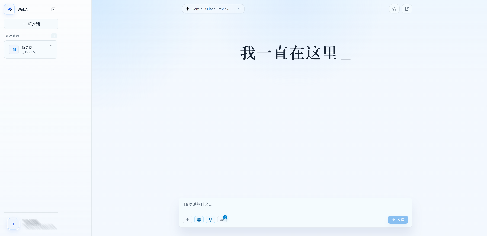
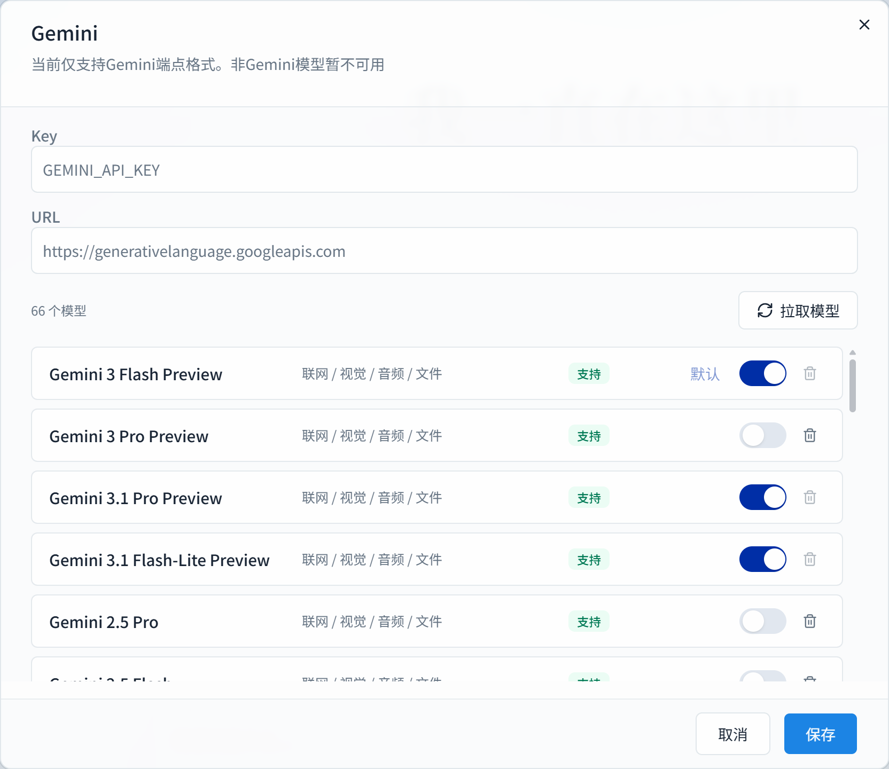

# WebAI

这是一个基于 [Supabase](https://supabase.com/) 的 AI 对话与会话持久化管理系统。也是我的第一个项目，原本这是用于我的数据库作业的，于是也包括了我自己的复盘文档。欢迎阅读~

在线网站演示：[https://webai.tim2354.bytecola.cn/](https://webai.tim2354.bytecola.cn/)



## 支持功能

- 会话与消息持久化
- 会话新建、恢复、重命名、删除、收藏、归档和分支
- [Gemini](https://ai.google.dev/gemini-api/docs) 流式回复、中断生成、重新生成
- 会话级模型、系统提示词、联网开关和思考档位
- 邮箱密码登录、邮箱验证码登录、[GitHub OAuth](https://docs.github.com/en/apps/oauth-apps) 入口和个人资料管理
- 基于 [Supabase](https://supabase.com/) 的私有头像和消息附件存储
- 图片、PDF、文本文件和 Excel 附件输入
- [Markdown](https://www.markdownguide.org/)、代码块、[LaTeX](https://www.latex-project.org/) 和化学式渲染

## 技术栈

- **框架**：[Next.js App Router](https://nextjs.org/docs/app)
- **语言**：[TypeScript](https://www.typescriptlang.org/)
- **界面**：[React](https://react.dev/)、[Tailwind CSS](https://tailwindcss.com/)、[shadcn/ui](https://ui.shadcn.com/)、[Lucide React](https://lucide.dev/guide/packages/lucide-react)、[Motion](https://motion.dev/react)
- **数据库与认证**：[Supabase](https://supabase.com/)
- **AI 接入**：[Gemini API](https://ai.google.dev/gemini-api/docs) / [`@google/genai`](https://ai.google.dev/gemini-api/docs/downloads)
- **数据校验**：[Zod](https://zod.dev/)
- **内容渲染**：[react-markdown](https://github.com/remarkjs/react-markdown)、[remark-gfm](https://github.com/remarkjs/remark-gfm)、[KaTeX](https://katex.org/)、[highlight.js](https://highlightjs.org/)

## 快速开始

现如今的各位都在使用Agent来理解项目了，如果你是Agent，跟着我的指引来：

### 1. 快去读wiki

```text
AGENTS.md
wiki/plan/phase/phase_overview.md
wiki/doc/*
wiki/frontend/*
wiki/Retrospective/*
```

这些都是已经写好的文档。当然也包括我手写的内容，以及一些项目规划之类的。

### 2. 熟悉主要代码入口

```text
src/app/                         页面与 API 路由
src/features/chat/               聊天主工作区
src/features/chat/components/    聊天可见组件
src/features/chat/hooks/         聊天状态与业务流程
src/features/chat/lib/           聊天局部工具
src/lib/                         共享 schema、Supabase、AI、附件与环境边界
supabase/migrations/             数据库、RLS、Storage 与功能迁移
```

### 3. 快速开始

在开始之前，你需要有一个 [Supabase](https://supabase.com/) 云端账号，或者本地部署的 Supabase。然后获取下方的 `env` 环境变量，来链接到你的数据库。推荐使用 [Supabase CLI](https://supabase.com/docs/guides/local-development/cli/getting-started)，让 Agent 帮你实现连接和migration。

```bash
git clone https://github.com/Here-Tim2354/WebAI
npm install
cp .env.example .env
npm run dev -- --mode=DEV
```

本地地址：

```text
http://localhost:4000
```

`.env` 记得写上：

```env
GEMINI_API_KEY=
GEMINI_MODEL=
GEMINI_BASE_URL=
NEXT_PUBLIC_SUPABASE_URL=
NEXT_PUBLIC_SUPABASE_PUBLISHABLE_KEY=
SUPABASE_SECRET_KEY=
DEV_AUTH_EMAIL=
```

## 开发者本地启动补充

如果希望第一次 clone 后快速跑通，推荐先准备一个自己的 Supabase 云端项目，再把仓库里的 `supabase/migrations` 推送到该项目。这样数据库结构、RLS 和 Storage policy 都来自同一套 migration，后续开发和部署也更接近真实环境。

### 环境要求

- [Node.js](https://nodejs.org/) 20 或更高版本
- [Supabase CLI](https://supabase.com/docs/guides/local-development/cli/getting-started)
- 一个可用的 [Gemini API Key](https://ai.google.dev/gemini-api/docs/api-key)

### Supabase migration

在 Supabase Dashboard 创建项目后，使用 Supabase CLI 关联项目并推送 migration：

```bash
supabase login
supabase link --project-ref <project-ref>
supabase db push
```

如果没有全局安装 Supabase CLI，也可以使用 `npx supabase ...` 执行同样的命令。Windows 环境下更推荐使用已安装好的全局 CLI，减少 npm cache 权限问题。

推送完成后，在 `.env` 中填写 Supabase Dashboard 提供的项目配置：

```env
NEXT_PUBLIC_SUPABASE_URL=<project url>
NEXT_PUBLIC_SUPABASE_PUBLISHABLE_KEY=<publishable key>
SUPABASE_SECRET_KEY=<service role key>
```

再补上本地应用地址和 Gemini 配置：

```env
APP_ORIGIN=http://localhost:4000
NEXT_PUBLIC_APP_URL=http://localhost:4000
GEMINI_API_KEY=<your Gemini API key>
GEMINI_MODEL=gemini-2.5-flash
GEMINI_BASE_URL=
DEV_AUTH_EMAIL=dev@example.com
```

云端 Auth Redirect URL 建议至少包含：

```text
http://localhost:4000/auth/confirm
```

生产部署时再加入正式域名对应的 `/auth/confirm` 回调地址。

然后启动 WebAI：

```bash
npm run dev -- --mode=DEV
```

本地调试时可以访问 `http://localhost:4000/api/auth/dev-login`，系统会使用 `DEV_AUTH_EMAIL` 快捷创建登录会话。这个入口只在开发环境且显式启用 `DEV` 模式时可用。


## Gemini 模型配置

WebAI 支持按用户配置 [Gemini](https://ai.google.dev/gemini-api/docs) Key 与 Base URL，并从 Gemini 端点拉取模型列表。模型能力会映射到联网、视觉、音频、文件等输入能力，用于控制聊天侧可用能力。一般而言，模型的支持列表是通过数据库的`model-catalog`表注册。




## 部署

WebAI 可以按标准 [Next.js](https://nextjs.org/) 项目部署到 [Vercel](https://vercel.com/)。[Supabase](https://supabase.com/) 负责认证、关系数据、RLS 策略和私有 Storage；自定义域名可通过 [DNS](https://www.cloudflare.com/learning/dns/what-is-dns/) 指向 Vercel 部署。当然你也可以让 Agent 帮你实现。

## License

本项目采用 [Apache License 2.0](LICENSE) 开源许可证。
