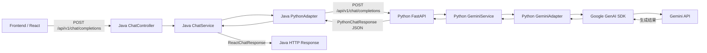
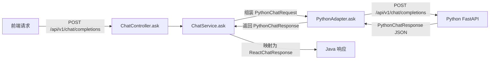
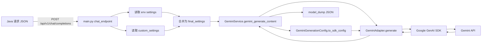

# 总架构
本项目是一个小全栈的WebAI项目，旨在简单地复刻一个AI聊天的网页。

```
WebAI
├── docs                    # 文档
├── frontend                # Vite构建的React前端
├── JavaBackend             # Java代码
├── python_backend          # Python代码
├── README.md               # 展示用文档
└── .gitignore 
```
前端为React，Java负责复杂的业务逻辑，Python端仅提供API端的服务。

# 目前阶段
目前处于MVP(最小可行性验证)的基本实现，即将迈入第二阶段。

## 开发日历表  
当前处于第一阶段：实现最基本的前后端业务跑通。具体为在网页发送一个消息，能得到一个返回的结构(暂不采用流式)

2025-02-03：  
**Feat**：根据GeminiAPI文档实现基本的API调用业务，并且实现了JAVA端通信Python端。

2025-02-12：  
**Feat**：初步实现从React到Java端的基本业务逻辑（即Request链路已完成）。测试类能够接受完整的JSON类型（尽管使用的是String.class）  
**Todo**：从Python端到JAVA端，以及从JAVA端到React端的业务逻辑还没实现（即Response端待开发）。比如PythonAdapter.java并没有好好根据Python端返回的完整API JSON写具体的处理逻辑。返回给React端的部分同样。

2025-02-19：  
**Feat**：初步实现了最基本的聊天对话页面，同时也完成了Request和Response全链路流程的构建。  
**Todo**：实现SSE流式传输。

# 具体技术栈
以下展示了三个语言的技术栈，以及相对应的依赖文件。

根据提交的最新进展实时更新内容。

## 总结
1. React + TypeScript + SSE 构建前端网页
2. Java 中台（最小实现）  
   Spring Boot 提供统一 API，`Controller -> Service -> Adapter` 分层，使用 `WebClient` 调用 Python 服务并做响应转换；JPA + PostgreSQL 用于后续会话持久化。
3. Python AI 服务（最小实现）  
   FastAPI 提供模型调用入口，Pydantic 做请求与配置建模，Service/Adapter 分层调用 `google-genai` 的官方SDK对接 Gemini。
4. 当前阶段  
   已打通“Java -> Python -> Gemini”的非流式Request链路；SSE 流式、历史存储、文件上传属于下一阶段。

当前全链路图：



## 前端
已完成最基本的对话网页
**技术栈**：React + Vite

## Java
目前已完成基础Request和Response链路

**技术栈**：Spring Boot + WebMVC + Maven + WebFlux + Validation + Spring Data JPA + PostgreSQL + Lombok（参考 `JavaBackend/pom.xml`）

当前结构采用 Controller -> Service -> Adapter 分层，便于后续接入流式响应与会话持久化。

**Java端请求链路（当前实现）**
1. 入口：`POST /api/v1/chat/completions` -> `ChatController.ask(...)`
2. 业务：`ChatService.ask(...)` 接收前端DTO并组装Python请求DTO
3. 适配：`PythonAdapter.ask(...)` 使用 `WebClient` 调用Python接口
4. 回传：将 `PythonChatResponse` 提取为 `ReactChatResponse`



**Java端关键结构（按目录）**
1. 控制层：`JavaBackend/src/main/java/com/tim/webai/javabackend/controller/ChatController.java`
2. 业务层：`JavaBackend/src/main/java/com/tim/webai/javabackend/service/ChatService.java`
3. 适配层：`JavaBackend/src/main/java/com/tim/webai/javabackend/adapter/PythonAdapter.java`
4. DTO层：
   `JavaBackend/src/main/java/com/tim/webai/javabackend/model/dto/react/`
   `JavaBackend/src/main/java/com/tim/webai/javabackend/model/dto/python/`
5. 配置层：`JavaBackend/src/main/resources/application.yaml`

## Python
**技术栈**：FastAPI + Uvicorn + Pydantic + pydantic-settings + google-genai（参考自 `python_backend/requirements.txt`）

**Python端请求链路（当前实现）**
1. 入口：`POST /api/v1/chat/completions` -> `chat_endpoint(...)`（`main.py`）
2. 配置：读取环境配置 `get_settings()`，并与 `custom_settings` 合并（`.env`环境变量配置文件暂不上传Github）
3. 服务：`GeminiService.gemini_generate_content(...)` 校验参数并组装SDK配置
4. 适配：`GeminiAdapter.generate(...)` 调用 `google-genai` 客户端
5. 回传：返回 SDK 的 JSON 结构给 Java 端



**Python端关键结构（按目录）**
1. 入口层：`python_backend/main.py`
2. 模型层：`python_backend/schemas.py`
3. 配置层：`python_backend/env_client_config.py`
4. 服务层：`python_backend/service/gemini_service.py`
5. 适配层：`python_backend/adapters/gemini_adapter.py`

