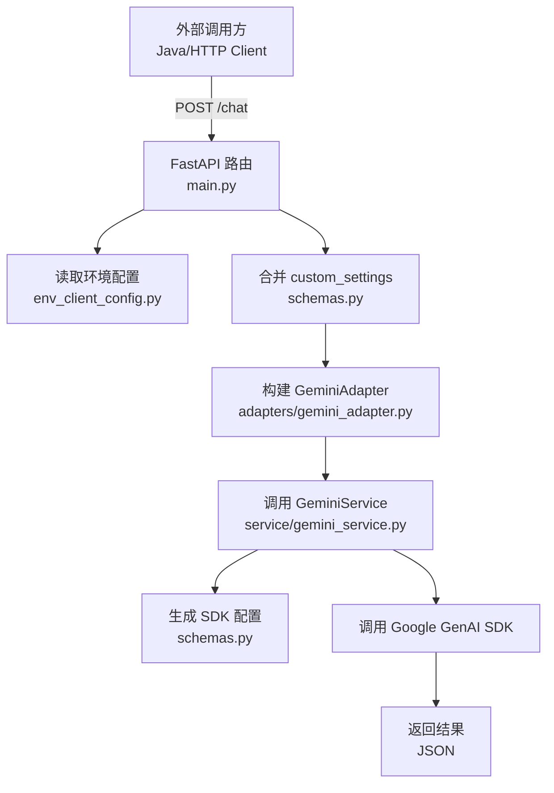

# python-backened 架构说明（MVP）

## 文件结构

```
python-backened
|-- .claude/
|-- adapters/
|   |-- gemini_adapter.py
|-- service/
|   |-- gemini_service.py
|-- .env
|-- env_client_config.py
|-- main.py
|-- python-module.iml
|-- requirements.txt
|-- schemas.py
|-- ARCHITECTURE.md
```

## 整体流程结构



## 目录与文件说明

- [main.py](main.py)
  - FastAPI 入口与路由定义（`/chat`）。
  - 负责请求入口、依赖注入配置、调用 Service 层并返回结果。

- [schemas.py](schemas.py)
  - 请求体与配置相关的数据模型（`JavaChatRequest`、`GeminiGenerationConfig` 等）。
  - 提供将配置转换为 SDK 所需结构的工具方法（`to_sdk_config()`）。

- [env_client_config.py](env_client_config.py)
  - 环境变量配置读取（`NativeGeminiClientSettings`）。
  - 通过 `get_settings()` 缓存配置实例。

- [adapters/gemini_adapter.py](adapters/gemini_adapter.py)
  - Google GenAI SDK 的轻量封装。
  - 负责初始化客户端与调用 `generate_content`。

- [service/gemini_service.py](service/gemini_service.py)
  - 业务逻辑层：校验配置、组装 SDK 配置并调用 Adapter。
  - 返回 SDK 结果的 JSON 序列化结构。

- [adapters/](adapters/)
  - 外部能力适配层（当前仅 Gemini）。

- [service/](service/)
  - 业务服务层（可扩展更多能力）。

- [.env](.env)
  - 环境变量文件（API Key/Base URL 等）。

- [python-module.iml](python-module.iml)
  - IDE 项目配置文件（非运行时依赖）。

- [requirements.txt](requirements.txt)
  - Python 依赖清单（用于安装运行所需包）。

## 关键职责边界

- **入口层（main.py）**：请求接入、参数绑定、依赖注入、调用业务层。
- **模型层（schemas.py）**：请求/配置结构，配置到 SDK 的转换。
- **适配层（adapters/）**：第三方 SDK 调用封装。
- **服务层（service/）**：业务流程编排与基本校验。

## MVP 目标对齐

- 结构清晰、职责分离明确。
- 便于后续扩展：新增模型、替换 LLM、增加中间件与统一响应。
