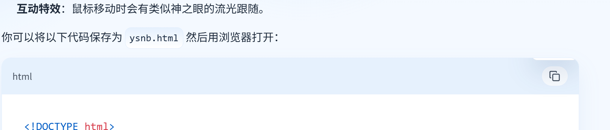
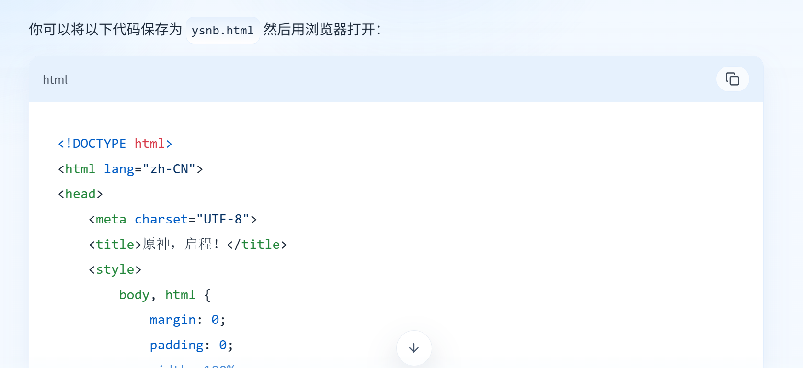

# bug

如图，复制后复制成功被截断
登录界面错别字：登陆
gmail无法收到验证码
qq邮箱第一次发送验证码其实发送的是确认账户存在的网站地址。
第二次才有验证码
# ui建议
## 对话框按钮
颜色不清晰，不知道有无选择
# 功能建议
当前不能多开对话
当前没有快捷键新建对话
长文本输出没有自动折叠，如输出长html，有的客户端是可以选择折叠文本的

如图，过长影响使用

回答完毕没有提示，可以加一个如上标原点、上标1.
下滑箭头是直接跳转到最下方，而不是下一个问题
当前似乎所有数据全部保存在服务器，包括对话、归档对话、等等，加载比较慢