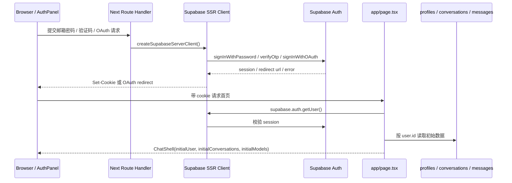

# auth chain

Auth chain 解决的是一个很基础但很容易被低估的问题：

**浏览器怎么证明“我是谁”，服务端怎么相信这个身份，并且所有数据库读写怎么自然落到这个用户边界里。**

在这个项目里，认证不是自己手写一套用户表和密码校验，而是让 Supabase Auth 承接主身份。项目代码只负责：

1. 给用户提供登录入口。
2. 调用 Supabase Auth 建立或清理 session。
3. 在 Server Component / Route Handler 中读取 cookie 里的 session。
4. 把 Supabase Auth 的 `user.id` 映射到业务表，比如 `profiles`、`conversations`、`messages`。
5. 在用户资料、头像、注销账户这些扩展功能里继续维护用户边界。

所以 auth chain 不是一个单点功能，而是一条贯穿前端、Next Route Handler、Supabase SSR client、数据库 RLS、Storage policy 的链。

## 先给结论

本项目的认证主链路可以理解为：

```txt
AuthPanel
  -> /api/auth/*
  -> createSupabaseServerClient()
  -> supabase.auth.*
  -> Supabase 写入/刷新 session cookie
  -> proxy.ts 每次请求刷新/传递 cookie
  -> page.tsx 服务端读取 user
  -> ChatShell 根据 initialUser 决定展示登录页还是工作区
  -> 业务 API 通过 getSupabaseAuthContext() 恢复用户身份
  -> 数据库 RLS / user_id / Storage 路径继续限制数据归属
```

更直观一点：



这里的关键不是“登录成功后前端存一个 user 状态”。

真正关键的是：**用户身份由 Supabase session cookie 维持，服务端每次需要身份时重新读取和校验，再用 `user.id` 进入业务数据边界。**

## 官方文档依据

这条链路主要依赖几份官方文档：

- [Supabase SSR Auth：Creating a Supabase client for SSR](https://supabase.com/docs/guides/auth/server-side/creating-a-client?framework=nextjs&package-manager=npm&queryGroups=framework&queryGroups=package-manager)
  - 说明 SSR 场景需要让 Supabase client 使用 cookie。
  - 说明 Next.js 里通常区分 browser client 和 server client。
  - 说明 Server Component 不能稳定写 cookie，所以需要 `proxy.ts` / middleware 类入口刷新并传递 session。
- [Supabase Password-based Auth](https://supabase.com/docs/guides/auth/passwords)
  - `signInWithPassword()` 用于邮箱密码登录。
  - `updateUser({ password })` 用于登录后更新密码。
  - 生产环境建议配置 Custom SMTP，这点对验证码和密码相关邮件都重要。
- [Supabase Passwordless email logins](https://supabase.com/docs/guides/auth/auth-email-passwordless)
  - Email OTP 和 Magic Link 共享 `signInWithOtp()`。
  - 邮件模板使用 `{{ .Token }}` 时就是验证码体验。
  - `verifyOtp({ email, token, type: "email" })` 会创建 session。
  - 默认会自动创建不存在的用户，除非设置 `shouldCreateUser: false`。
- [Supabase Social Login](https://supabase.com/docs/guides/auth/social-login)
  - OAuth 的作用是把第三方平台的登录能力交给 Supabase Auth 编排。
  - 本项目的 GitHub 登录就是这一类。
- [Supabase Signout](https://supabase.com/docs/guides/auth/signout)
  - `signOut()` 清理当前 Auth session。
  - Supabase 也支持不同 sign out scope，不过本项目目前使用默认行为。
- [Supabase User Management](https://supabase.com/docs/guides/auth/managing-user-data)
  - Auth schema 不直接暴露给自动 API。
  - 如果需要用户业务资料，应在 `public` schema 创建自己的表，例如 `profiles`。
  - `profiles` 应引用 `auth.users`，并使用 `on delete cascade`。
  - 删除 Auth 用户前要注意 Storage 对象所有权，否则会遇到删除失败。
- [Next.js Route Handlers](https://nextjs.org/docs/app/api-reference/file-conventions/route)
  - `app/api/**/route.ts` 通过 `GET/POST/PATCH/DELETE` 等函数声明接口。
  - Route Handler 可以读取 `request.json()`、`request.formData()`，也可以返回 `NextResponse.json()` 或重定向。
- [Next.js cookies](https://en.nextjs.im/docs/app/api-reference/functions/cookies/)
  - cookie 修改本质上是通过响应头告诉浏览器保存。
  - 写 cookie 需要发生在 Server Function 或 Route Handler 这类能设置响应头的地方。

当然，官方文档不会替这个项目设计所有体验，比如本项目的邮箱验证码冷却、工作区提示、头像代理读取、注销账户 Storage 清理，都是在官方能力上叠出来的产品链路。

## 涉及代码总览

先把所有相关文件列出来，后面再按请求链路细讲。

### 前端入口

- `src/features/chat/components/auth-panel.tsx`
  - 未登录时的登录面板。
  - 支持邮箱密码、邮箱验证码、GitHub 登录。
  - 负责登录反馈、验证码冷却、保存上次邮箱、登录成功后跳转。
- `src/features/chat/components/chat-shell.tsx`
  - 页面壳层。
  - 如果 `initialUser` 为空，渲染 `AuthPanel`。
  - 如果 `initialUser` 存在，渲染聊天工作区。
  - 承接退出登录、注销账户、修改资料、上传头像、修改密码。
- `src/app/page.tsx`
  - 首页 Server Component。
  - 服务端读取 Supabase user。
  - 登录后读取会话、模型、个人资料，再传给 `ChatShell`。

### 认证 API

- `src/app/api/auth/password/route.ts`
  - 邮箱密码登录。
- `src/app/api/auth/email-code/send/route.ts`
  - 发送邮箱验证码。
- `src/app/api/auth/email-code/verify/route.ts`
  - 验证邮箱验证码并建立 session。
- `src/app/api/auth/github/route.ts`
  - 发起 GitHub OAuth。
- `src/app/api/auth/sign-out/route.ts`
  - 退出登录。
- `src/app/api/auth/dev-login/route.ts`
  - 本地开发模式快捷登录。
- `src/app/auth/confirm/route.ts`
  - Supabase 邮件链接或 OAuth 回跳确认入口。

### 用户资料 API

- `src/app/api/profile/route.ts`
  - 读取 / 修改用户展示资料。
- `src/app/api/profile/avatar/route.ts`
  - 上传 / 代理读取头像。
- `src/app/api/profile/password/route.ts`
  - 修改当前登录用户密码。
- `src/app/api/profile/account/route.ts`
  - 注销账户，清理 Storage，再删除 Supabase Auth 用户。

### Supabase 基础设施

- `proxy.ts`
  - 每次请求进入时调用 `updateSession()`。
- `src/lib/supabase/proxy.ts`
  - 创建 proxy 层 Supabase client，刷新 session cookie，并写安全响应头。
- `src/lib/supabase/server.ts`
  - Server Component / Route Handler 共用的 Supabase SSR client。
- `src/lib/supabase/auth.ts`
  - `getSupabaseAuthContext()` 和 `mapAuthUser()`。
- `src/lib/supabase/admin.ts`
  - service role / secret key 的 admin client，只能用于服务端敏感操作。
- `src/lib/supabase/profiles.ts`
  - `profiles` 表读写。

### 数据契约与数据库

- `src/lib/schemas/auth.ts`
  - 登录请求、验证码请求、前端用户对象的 Zod schema。
- `src/lib/rate-limit.ts`
  - 进程内轻量限流。
- `src/lib/env/app-origin.ts`
  - 登录回跳 URL 的可信来源构造。
- `supabase/migrations/20260325144537_phase3_core_schema.sql`
  - `profiles / conversations / messages` 基础表。
  - `profiles.user_id references auth.users(id) on delete cascade`。
  - `handle_new_user()` trigger。
  - 基础 RLS policy。
- `supabase/migrations/20260511193000_phase5_profile_avatars.sql`
  - 私有头像 bucket。
  - Storage policy 按用户 ID 一级目录隔离。

## 数据对象关系

这里先把“用户是谁”和“用户有什么资料”分开看。

### `auth.users`

`auth.users` 是 Supabase Auth 管理的认证主表。

它负责：

- 用户 ID。
- 邮箱。
- 外部 OAuth identity。
- 密码哈希。
- session / refresh token 相关认证语义。

项目代码不直接把 `auth.users` 当普通业务表 CRUD。官方也建议：Auth schema 不直接暴露给自动 API，如果要保存展示资料，应建立自己的 `public` 表。

### `profiles`

`profiles` 是项目自己的用户展示资料表。

它负责：

- `display_name`
- `avatar_url`

在 migration 里：

```sql
create table if not exists public.profiles (
  user_id uuid primary key references auth.users(id) on delete cascade,
  display_name varchar(100),
  avatar_url varchar(500),
  created_at timestamptz not null default now(),
  updated_at timestamptz not null default now()
);
```

这个设计很标准：

- 登录身份归 Supabase Auth。
- 产品资料归 `profiles`。
- `profiles.user_id` 和 `auth.users.id` 一对一。
- 用户删除后，资料跟着级联删除。

### `profile_avatars`

头像不放数据库里，而是放 Supabase Storage 私有 bucket。

数据库只保存路径：

```txt
profiles.avatar_url = <user_id>/avatar-<timestamp>.<ext>
```

Storage policy 通过第一层目录判断对象归属：

```sql
(storage.foldername(name))[1] = auth.uid()::text
```

这样头像对象不是公开 URL，浏览器读取头像时要走：

```txt
GET /api/profile/avatar?path=...
```

这个代理路由会检查当前用户和路径前缀，再从 Storage 下载。

## 基础设施链路：cookie 和 session 是怎么续上的

### `proxy.ts`

最外层是根目录的 `proxy.ts`：

```ts
export async function proxy(request: NextRequest) {
  return updateSession(request);
}
```

它的 matcher 排除了静态资源：

```ts
"/((?!_next/static|_next/image|favicon.ico|.*\\.(?:svg|png|jpg|jpeg|gif|webp)$).*)"
```

意思是普通页面和 API 请求都会经过 proxy，但图片、Next 静态资源这些不需要 Supabase session 的请求不走。

### `src/lib/supabase/proxy.ts`

`updateSession()` 做三件事：

1. 用请求 cookie 创建 Supabase SSR client。
2. 调用 `supabase.auth.getUser()` 触发 session 检查 / 刷新。
3. 如果 Supabase 写了新 cookie，同时写回 request 副本和 response。

关键逻辑是：

```ts
cookiesToSet.forEach(({ name, value }) => {
  request.cookies.set(name, value);
});

supabaseResponse = NextResponse.next({ request });

cookiesToSet.forEach(({ name, value, options }) => {
  supabaseResponse.cookies.set(name, value, options);
});
```

这里有两个方向：

- `request.cookies.set`：让后续 Server Component / Route Handler 在同一轮请求里能读到刷新后的 session。
- `response.cookies.set`：让浏览器保存新的 session cookie。

这就是 SSR Auth 里最容易绕晕的地方：**服务端读到 cookie 还不够，还得把刷新后的 cookie 写回浏览器。**

另外这里还补了安全头：

```ts
X-Content-Type-Options: nosniff
X-Frame-Options: DENY
Referrer-Policy: strict-origin-when-cross-origin
Permissions-Policy: camera=(), microphone=(), geolocation=(), payment=()
```

这些不是登录本身必须的，但对上线后的基础安全边界有价值。

### `src/lib/supabase/server.ts`

Server Component 和 Route Handler 用的是：

```ts
createSupabaseServerClient()
```

它同样用 `@supabase/ssr` 的 `createServerClient`，但 cookie 来源换成了 Next 的：

```ts
const cookieStore = await cookies();
```

`setAll` 里有一个 `try/catch`：

```ts
try {
  cookieStore.set(...)
} catch {
  // Server Components 中不能稳定写出响应 cookie。
}
```

这和 Next cookies 文档是对应的：写 cookie 需要能设置响应头。Server Component 不一定能稳定写出响应 cookie，所以项目把真正稳定的刷新写回放在 `proxy.ts`。

### 可改进点：`getUser()` 与 `getClaims()` 的取舍

本项目在 proxy 和服务端读取用户时使用 `supabase.auth.getUser()`。

这个选择的好处是直观，而且会向 Supabase Auth 服务端校验用户，适合项目早期和中小规模产品。

但 Supabase 最新 SSR 文档里，对保护页面和用户数据的表述更偏向 `getClaims()`，并明确不要在服务端信任 `getSession()`。这里值得后续评估：

- 如果项目使用非对称 JWT 签名，`getClaims()` 可以本地验证 JWT 签名，减少一次网络请求。
- 如果项目更在意“服务端已登出/撤销后尽快反映”，`getUser()` 的远端校验更保守，但成本更高。

不管选哪一个，底线是一样的：**服务端不要只信 `getSession()` 这种本地 session 快照。**

## 首页恢复链路

文件：`src/app/page.tsx`

首页是 Server Component。它先创建 Supabase server client：

```ts
const supabase = await createSupabaseServerClient();
const {
  data: { user },
} = await supabase.auth.getUser();
```

如果没有用户，并且是开发 DEV 模式，就跳到：

```txt
/api/auth/dev-login
```

否则：

```ts
const conversations = user
  ? await listConversations(supabase, user.id)
  : [];
const models = user ? await listEnabledModels(supabase, user.id) : [];
const profile = user ? await getUserProfile(supabase, user.id) : null;
```

这一步很重要。

它不是让浏览器先渲染一个空壳，再靠 `useEffect` 慢慢判断登录态，而是服务端直接恢复：

- 当前用户。
- 会话列表。
- 可用模型。
- 用户资料。

然后传给：

```tsx
<ChatShell
  initialUser={user ? mapAuthUser(user, profile) : null}
  initialConversations={conversations}
  initialModels={models}
  initialAuthMessage={initialAuthMessage}
  initialAuthMessageType={initialAuthMessageType}
/>
```

这就是 SSR Auth 的体验收益：刷新页面后，工作区不需要明显闪一下登录页。

## 前端入口：`AuthPanel`

文件：`src/features/chat/components/auth-panel.tsx`

`AuthPanel` 是未登录时的入口。

它有两种主模式：

```ts
type AuthMode = "password" | "email-code";
```

还额外有 GitHub 登录按钮。

它维护的状态包括：

- `email`
- `password`
- `emailCode`
- 各种 submitting 状态
- `emailCodeCooldown`
- `feedback`

这里的设计目标比较清楚：认证真正发生在服务端 API，前端只负责收集输入、展示状态、跳转。

### 登录反馈恢复

`AuthPanel` 挂载时会做两件事：

1. 从 `localStorage` 读取上次使用的邮箱。
2. 从 URL query/hash 解析登录回跳结果。

```ts
const queryParams = new URLSearchParams(window.location.search);
const hashParams = new URLSearchParams(window.location.hash.slice(1));
```

为什么要同时看 query 和 hash？

因为不同登录/回跳方式可能把状态放在不同位置。项目把它们统一收口成 `feedback`，这样用户看到的提示区域是同一个，不会出现某种回跳失败但页面没反应。

### 密码登录

前端提交：

```txt
POST /api/auth/password
```

请求体：

```json
{
  "email": "user@example.com",
  "password": "..."
}
```

成功后：

```ts
rememberLoginSuccessNotice();
window.location.assign("/");
```

这里没有在前端手动保存 token。session cookie 是服务端 Supabase client 写回的。

### 邮箱验证码

邮箱验证码分两步：

1. 发送验证码：`POST /api/auth/email-code/send`
2. 验证验证码：`POST /api/auth/email-code/verify`

发送后前端设置 60 秒冷却：

```ts
setEmailCodeCooldown(EMAIL_CODE_COOLDOWN_SECONDS);
```

这个和 Supabase 默认 OTP 发送限制是贴合的。前端冷却不是安全边界，只是减少用户连续点击后撞服务端限流。

### GitHub 登录

点击 GitHub 登录时：

```ts
window.location.assign("/api/auth/github");
```

这条链路会跳出当前页面，进入 Supabase OAuth flow。

## 密码登录链路

文件：`src/app/api/auth/password/route.ts`

流程：

```txt
request.json()
  -> signInWithPasswordRequestSchema.safeParse()
  -> email lowercase
  -> 按邮箱和 IP 限流
  -> createSupabaseServerClient()
  -> supabase.auth.signInWithPassword()
  -> 返回 ok
```

对应代码：

```ts
const { error } = await supabase.auth.signInWithPassword({
  email: normalizedEmail,
  password: parsed.data.password,
});
```

这里有两个细节。

第一，报错统一返回：

```txt
邮箱或密码不正确。
```

这避免了暴露“邮箱存在但密码错”或“邮箱不存在”这类枚举信息。

第二，它做了两层限流：

```txt
password-login:email:<email>  15 分钟 8 次
password-login:ip:<ip>        15 分钟 20 次
```

这比只按 IP 好一点。只按 IP 容易误伤同网段用户，只按邮箱又挡不住大量扫邮箱。

## 邮箱验证码链路

### 发送验证码

文件：`src/app/api/auth/email-code/send/route.ts`

流程：

```txt
request.json()
  -> sendEmailCodeRequestSchema.safeParse()
  -> email lowercase
  -> 按邮箱和 IP 限流
  -> createAppUrl("/auth/confirm")
  -> supabase.auth.signInWithOtp()
  -> 返回“验证码已发送”
```

核心调用：

```ts
await supabase.auth.signInWithOtp({
  email: normalizedEmail,
  options: {
    emailRedirectTo: redirectTo.toString(),
  },
});
```

Supabase 文档里说明，Email OTP 和 Magic Link 共享 `signInWithOtp()`。如果邮件模板里使用 `{{ .Token }}`，用户看到的就是验证码；如果使用确认链接，就是 Magic Link。

本项目的用户体验是验证码，但仍然传了 `emailRedirectTo`。这样如果邮件里仍包含确认链接，或者后续保留 Magic Link 入口，也能回到统一的 `/auth/confirm`。

### 验证验证码

文件：`src/app/api/auth/email-code/verify/route.ts`

流程：

```txt
request.json()
  -> verifyEmailCodeRequestSchema.safeParse()
  -> email lowercase
  -> 按邮箱和 IP 限流
  -> supabase.auth.verifyOtp({ email, token, type: "email" })
  -> Supabase 建立 session
  -> 返回 ok
```

核心调用：

```ts
await supabase.auth.verifyOtp({
  email: normalizedEmail,
  token: parsed.data.token,
  type: "email",
});
```

验证码 schema 是：

```ts
regex(/^\d{6,10}$/)
```

这里不是死锁 6 位，而是兼容 6-10 位。因为 Supabase OTP 位数可以配置，前端不应该把邮件模板配置写死。

### 自动注册语义

Supabase 文档里说明，`signInWithOtp()` 默认会为不存在的用户自动创建账户，除非设置 `shouldCreateUser: false`。

本项目没有设置 `shouldCreateUser: false`，所以产品文案里写：

```txt
首次使用邮箱验证码或 GitHub 登录时，会自动创建账户。
```

这是合理的，不是前端自己造出来的注册逻辑。

## OAuth / GitHub 登录链路

文件：`src/app/api/auth/github/route.ts`

流程：

```txt
GET /api/auth/github
  -> createSupabaseServerClient()
  -> createAppUrl("/auth/confirm")
  -> supabase.auth.signInWithOAuth({ provider: "github" })
  -> 重定向到 Supabase/GitHub 授权地址
```

核心调用：

```ts
const { data, error } = await supabase.auth.signInWithOAuth({
  provider: "github",
  options: {
    redirectTo,
  },
});
```

这条 route 自己不处理 GitHub code，也不保存第三方 token。

它只负责拿到授权 URL：

```ts
return NextResponse.redirect(data.url);
```

后面用户从 GitHub / Supabase 回来，会进入 `/auth/confirm`。

## 回调确认链路

文件：`src/app/auth/confirm/route.ts`

这个路由比较关键，它同时处理两类情况：

1. OAuth / PKCE code：`?code=xxx`
2. 邮件 token hash：`?token_hash=xxx&type=email`

### OAuth code

```ts
if (code) {
  const { error } = await supabase.auth.exchangeCodeForSession(code);
  ...
}
```

`exchangeCodeForSession` 会把 OAuth 回来的 code 换成 Supabase session。

然后 redirect 到首页：

```txt
/?auth=success
```

或：

```txt
/?auth=error
```

### token hash

```ts
await supabase.auth.verifyOtp({
  token_hash: tokenHash,
  type,
});
```

这对应 Supabase 文档里的 PKCE / Magic Link hash 处理方式。成功后，SSR client 会把 session cookie 写回响应。

为什么最后要回到首页？

因为首页 `page.tsx` 是整个工作区的服务端恢复入口。回到首页后，服务端会重新 `getUser()`，再把用户、会话、模型、资料一起传给 `ChatShell`。

## 退出登录链路

前端入口：`ChatShell.handleSignOut()`

```txt
POST /api/auth/sign-out
```

服务端：

```ts
await supabase.auth.signOut();
```

成功后前端做三件事：

1. `setUser(null)`
2. `resetAfterSignOut()`
3. `router.refresh()`

`resetAfterSignOut()` 很重要。因为只清 cookie 不够，前端内存里还可能有：

- 会话列表。
- 当前激活会话。
- 消息缓存。
- 模型状态。

退出时必须把工作区状态清掉，否则会出现“UI 看起来退出了，但内存里还残留上一个用户数据”的问题。

## 开发模式快捷登录

文件：

- `src/app/page.tsx`
- `src/app/api/auth/dev-login/route.ts`

首页里判断：

```ts
process.env.NODE_ENV === "development" &&
(process.env.MODE === "DEV" || process.env.npm_config_mode === "DEV")
```

如果没有 user，就跳到：

```txt
/api/auth/dev-login
```

`dev-login` 做的不是伪造 cookie，而是：

1. 使用 service role client。
2. 调用 `supabase.auth.admin.generateLink({ type: "magiclink" })`。
3. 取出 `hashed_token` 和 `verification_type`。
4. 拼成 `/auth/confirm?token_hash=...&type=...`。
5. 让正常确认链路继续建立 session。

这个设计比“本地手写一个假用户对象”靠谱很多，因为它仍然经过 Supabase Auth 的确认逻辑。

当然它必须严格限制在开发环境。目前 route 在非 DEV 模式返回 404，这是正确边界。

## 资料链路：登录身份和展示资料分开

### 读取和修改资料

文件：

- `src/app/api/profile/route.ts`
- `src/lib/supabase/profiles.ts`

每次进入 profile API，先做：

```ts
const { supabase, user } = await getSupabaseAuthContext();
```

如果没有 user，返回 401。

读取资料：

```ts
getUserProfile(supabase, user.id)
```

修改资料：

```ts
updateUserProfile(supabase, user.id, {
  displayName: body.displayName?.trim() || null,
})
```

`updateUserProfile` 用的是 `upsert`：

```ts
.upsert(payload, { onConflict: "user_id" })
```

这意味着即使 trigger 没来得及创建 `profiles` 记录，用户修改资料时也能补上。

### `mapAuthUser`

文件：`src/lib/supabase/auth.ts`

```ts
export function mapAuthUser(user: User, profile?: UserProfile | null) {
  return {
    id: user.id,
    email: user.email ?? null,
    displayName: profile?.displayName ?? null,
    avatarUrl: profile?.avatarUrl ?? null,
  };
}
```

这个函数的意义是：前端只拿需要展示和识别的字段，不把 Supabase 原始 `User` 整个丢给浏览器组件。

## 头像链路

文件：`src/app/api/profile/avatar/route.ts`

### 上传头像

流程：

```txt
request.formData()
  -> 取 avatar 文件
  -> 校验类型 PNG/JPG/WebP
  -> 校验大小 <= 2MB
  -> 生成 <user.id>/avatar-<timestamp>.<ext>
  -> 上传到 profile_avatars bucket
  -> profiles.avatar_url 保存 Storage path
  -> 返回 mapAuthUser(user, profile)
```

关键路径：

```ts
const storagePath = `${user.id}/avatar-${Date.now()}.${getAvatarExtension(file)}`;
```

这和 Storage policy 对齐：第一层目录就是 user ID。

### 读取头像

头像读取不是公开 bucket URL，而是：

```txt
GET /api/profile/avatar?path=<storagePath>
```

路由先检查：

```ts
storagePath.startsWith(`${user.id}/`)
```

然后：

```ts
supabase.storage.from(PROFILE_AVATARS_BUCKET).download(storagePath)
```

最终返回二进制 Response：

```ts
return new Response(data, {
  headers: {
    "Content-Type": data.type || "image/jpeg",
    "Cache-Control": "private, max-age=300",
  },
});
```

效果是：

- 头像 bucket 可以保持私有。
- 浏览器仍然能用普通 `` 访问头像代理地址。
- 其他用户不能通过猜路径读取你的头像。

## 修改密码链路

文件：`src/app/api/profile/password/route.ts`

流程：

```txt
getSupabaseAuthContext()
  -> user 必须存在
  -> password schema 校验
  -> supabase.auth.updateUser({ password })
  -> 返回 ok
```

密码规则：

```ts
min(8)
max(72)
```

72 这个上限通常和 bcrypt 一类密码哈希实践有关：很多系统会在 72 字节附近有有效长度边界。这里至少比无限长密码直接丢给后端更稳。

可改进点后面会说：修改密码最好要求当前密码、或至少要求近期重新认证。

## 注销账户链路

文件：`src/app/api/profile/account/route.ts`

注销账户是 auth chain 里风险最高的一段。

流程：

```txt
getSupabaseAuthContext()
  -> user 必须存在
  -> createSupabaseAdminClient()
  -> 删除 profile_avatars 里 user.id 目录对象
  -> 删除 message_attachments 里 user.id 目录对象
  -> admin.auth.admin.deleteUser(user.id)
  -> supabase.auth.signOut()
  -> 返回 ok
```

为什么删除 Auth 用户前要先删 Storage？

Supabase User Management 文档里提醒：如果 Auth 用户拥有 Storage 对象，删除用户时可能遇到错误。所以本项目先清理：

```ts
await Promise.all([
  removeUserStorageObjects(admin, PROFILE_AVATARS_BUCKET, user.id),
  removeUserStorageObjects(admin, MESSAGE_ATTACHMENTS_BUCKET, user.id),
]);
```

然后：

```ts
await admin.auth.admin.deleteUser(user.id);
await supabase.auth.signOut();
```

业务表的清理依赖外键级联：

- `profiles.user_id -> auth.users.id on delete cascade`
- `conversations.user_id -> auth.users.id on delete cascade`
- `messages.conversation_id -> conversations.id on delete cascade`
- `favorites.user_id / conversation_id` 也应跟随级联关系清理

这里的设计效果是：注销账户不是只让用户退出登录，而是真正删除 Auth 主身份，并让业务数据一起被清理。

## 其他业务 API 怎么接入 auth chain

几乎所有需要登录的业务 route 都会走：

```ts
const { supabase, user } = await getSupabaseAuthContext();

if (!user) {
  return unauthorizedResponse();
}
```

例如：

- `/api/chat`
- `/api/conversations`
- `/api/messages/[messageId]`
- `/api/models`
- `/api/attachments/upload`
- `/api/profile`

这个公共入口让每个 route 不需要重复写：

```ts
const supabase = await createSupabaseServerClient();
const { data: { user } } = await supabase.auth.getUser();
```

但要注意：`getSupabaseAuthContext()` 只恢复身份，不自动做业务授权。

比如读取会话时还必须：

```ts
.eq("user_id", user.id)
```

或者依赖 RLS policy。也就是说，认证只回答“你是谁”，授权还要回答“你能不能访问这个资源”。

## 设计效果

这条 auth chain 带来的效果有四个。

### 1. 刷新页面后能恢复工作区

因为首页是 Server Component，且 Supabase session 存在 cookie 里，所以刷新页面后：

```txt
浏览器带 cookie 请求 /
  -> page.tsx getUser()
  -> 读取 conversations/models/profile
  -> ChatShell 直接拿到 initialUser
```

这比纯前端 `useEffect` 判断登录态更稳。

### 2. 登录方式可以扩展，但最终都归一到 session

密码登录、邮箱验证码、GitHub OAuth、dev-login 看起来是四条入口，但最终都变成：

```txt
Supabase Auth session cookie
```

后面的工作区不需要关心用户是怎么登录的。

### 3. 业务表天然围绕 `user.id` 分区

会话、模型、资料、头像目录都围绕 `user.id` 组织。这样课程设计里的用户-会话-消息关系也比较好解释。

### 4. 前端状态和服务端身份没有混在一起

前端 `user` 状态只是展示层状态。真正的身份以服务端 cookie / Supabase Auth 为准。

这点很重要。否则只要浏览器手动改一个 localStorage，就可能伪装成另一个用户。

## 可以改进的地方

下面这些不是“必须马上做”，但如果按更成熟的开源项目标准来看，确实值得排进后续安全和产品化优化。

### 1. 生产限流不应该只靠进程内 `Map`

现在 `src/lib/rate-limit.ts` 使用进程内 `Map`：

```ts
const buckets = new Map<string, RateLimitBucket>();
```

这适合本地和单进程轻量保护，但在 Vercel / serverless / 多实例环境下会有几个问题：

- 不同实例之间不共享计数。
- 函数冷启动后计数会丢。
- 攻击流量如果打散到多个实例，限流效果会变弱。

更成熟的做法：

- Cloudflare WAF / Rate Limiting 保护认证入口。
- Supabase Auth 自带 rate limit 配置继续打开。
- 应用层可用 Upstash Redis、Vercel KV、Supabase 表或专门限流服务做分布式计数。

### 2. 邮箱验证码发送入口可以加 CAPTCHA 或 Turnstile

邮箱验证码接口是典型高风险入口：

```txt
POST /api/auth/email-code/send
```

现在有邮箱 + IP 限流，但还可以加：

- Cloudflare Turnstile。
- hCaptcha。
- Supabase Auth CAPTCHA 配置。

尤其是公网环境，发邮件能力很容易被滥用。验证码发送失败还会影响真实用户收信体验。

### 3. 修改密码最好要求当前密码或近期重新认证

现在修改密码只要求用户已经登录：

```ts
await supabase.auth.updateUser({
  password: body.password,
});
```

这对基础产品可用，但安全性还不够理想。

更稳的做法：

- 要求输入当前密码。
- 或使用 Supabase 支持的 `currentPassword` 参数。
- 或要求“近期重新登录”后才能修改密码。

原因很简单：如果用户电脑上已经有登录态，别人短暂拿到浏览器就可以直接改密码。

### 4. 注销账户应该有更强确认

`DELETE /api/profile/account` 是破坏性接口。

成熟产品通常会加：

- 输入邮箱确认。
- 输入固定文案确认，比如“确认注销”。
- 重新输入密码或验证码。
- 给用户展示会删除哪些数据。
- 后端做 CSRF / Origin 校验。

现在的接口已经做了身份校验和 Storage 清理，但产品层确认强度还可以再上一个台阶。

### 5. Cookie 认证的敏感 mutation 可以补 Origin / CSRF 防护

项目的敏感接口包括：

- `POST /api/auth/sign-out`
- `PATCH /api/profile/password`
- `DELETE /api/profile/account`
- `POST /api/profile/avatar`

这些接口依赖 cookie 认证。浏览器是否会在跨站请求里带 cookie，取决于 cookie 的 `SameSite` 等属性；但成熟项目通常不会只靠默认行为。

可以补：

- 检查 `Origin` 是否等于 `APP_ORIGIN`。
- 对敏感操作使用 CSRF token。
- 对 `DELETE /api/profile/account` 这类操作加二次确认 token。

### 6. 头像上传后旧头像可以清理

现在头像路径带时间戳：

```txt
<user_id>/avatar-<timestamp>.<ext>
```

每次上传都会生成新对象，但不会立即删除旧头像。文档里也已经记录了这一点。

这不会影响功能，但长期会产生 Storage 垃圾。

可选优化：

- 上传新头像成功后删除旧 `profiles.avatar_url` 指向的对象。
- 或保留最近 N 个头像，后台定期清理。
- 或改成固定对象 key，比如 `<user_id>/avatar.<ext>`，配合 upsert，但要处理扩展名变化和缓存失效。

### 7. 头像代理读取可以更严格校验路径

当前检查：

```ts
storagePath.startsWith(`${user.id}/`)
```

这已经能挡住明显越权读取。但可以更严格：

- 禁止 `..`。
- 使用统一的 storage path parser。
- 检查路径形态必须是 `<user_id>/avatar-<timestamp>.<ext>`。

虽然 Supabase Storage 不是本地文件系统，不等于传统路径穿越，但安全边界最好越明确越好。

### 8. 未登录响应可以抽出公共 helper

现在多个 route 里都有类似：

```ts
function unauthorizedResponse() {
  return NextResponse.json(
    { error: { message: "请先登录后再继续。" } },
    { status: 401 },
  );
}
```

这不是大问题，但重复多了之后容易出现文案或结构不一致。

可以抽成：

```ts
createUnauthorizedResponse()
createErrorResponse(message, status)
```

但不要过度抽象。只抽真正反复出现的响应结构即可。

### 9. Auth 事件和安全审计可以补一层记录

现在登录失败、限流、改密、注销账户这些事件主要返回给用户，没有形成服务端审计日志。

如果后续产品化，可以记录：

- 登录失败次数。
- OTP 发送频率。
- 修改密码时间。
- 注销账户时间。
- OAuth 登录失败原因。

注意这类日志不要记录明文密码、验证码、完整 token。只记录必要元数据即可。

### 10. `getUser()` / `getClaims()` 策略可以写成明确决策

这个属于文档和架构决策问题。

建议后续在开发者文档里明确：

```txt
本项目服务端身份读取默认使用 getUser()
原因：更保守地向 Supabase Auth 校验 session。
代价：每次身份恢复有网络请求成本。
后续如切换到 getClaims()，需要确认 JWT signing keys、撤销语义和缓存策略。
```

这样以后看到 Supabase 最新文档推荐 `getClaims()` 时，不会误以为当前代码就是随手写的。

## 小结

这条 auth chain 的核心可以压缩成一句话：

**Supabase Auth 负责认证主身份，Next SSR cookie 链路负责在服务端恢复身份，项目业务表和 Storage 通过 `user.id` 继续划定数据边界。**

具体链路里，最值得掌握的是这几个点：

1. `AuthPanel` 只是入口，不保存 token。
2. `/api/auth/*` 调 Supabase Auth，session cookie 由 SSR client 写回。
3. `proxy.ts` 负责刷新和传递 cookie。
4. `page.tsx` 服务端读取 user，并决定首屏工作区数据。
5. 所有业务 API 通过 `getSupabaseAuthContext()` 恢复身份。
6. `profiles` 只保存展示资料，不替代 `auth.users`。
7. Storage 私有对象通过用户 ID 目录和代理路由保护。
8. 注销账户要先清 Storage，再删 Auth 用户，最后清当前 session。

当然，这条链路已经能支撑产品使用，但如果按更成熟的开源项目标准继续打磨，下一批最值得优先做的是：

1. 分布式限流。
2. 验证码发送 CAPTCHA。
3. 敏感 mutation 的 CSRF / Origin 校验。
4. 修改密码前的当前密码或近期重新认证。
5. 注销账户的二次确认。

# security chain

# model  schema chain

# stream chain

# positive feature
