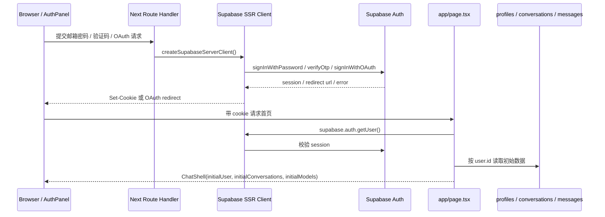

# auth chain

Auth chain 要解决的问题很直接：

**浏览器怎么证明“我是谁”，服务端怎么相信这个身份，后面的数据库读写又怎么自然落到这个用户边界里。**

WebAI 没有自己手写用户表和密码校验，而是把主身份交给 Supabase Auth。项目代码负责把这套身份接到产品里：登录入口、session cookie、服务端恢复、业务表 `user_id`、Storage 用户目录、RLS policy。

所以这里的 auth chain 不是一个登录按钮，而是一整条链：

```txt
AuthPanel
  -> /api/auth/*
  -> createSupabaseServerClient()
  -> supabase.auth.*
  -> Supabase 写入或刷新 session cookie
  -> proxy.ts 继续刷新和传递 cookie
  -> app/page.tsx 服务端读取 user
  -> ChatShell 根据 initialUser 展示登录页或工作区
  -> 业务 API 通过 getSupabaseAuthContext() 恢复用户身份
  -> 数据库 RLS / user_id / Storage 路径继续限制数据归属
```

这条链里最重要的一点是：**前端的 `user` 只是展示状态，真正可信的身份来自服务端读取 Supabase session 后拿到的 `user.id`。**



## 涉及文件

先把文件位置压在这里，后面看链路时方便跳。

前端入口：

- `src/features/chat/components/auth-panel.tsx`
  - 未登录时的登录面板。
  - 支持邮箱密码、邮箱验证码、GitHub 登录。
  - 只负责输入、反馈、冷却和跳转，不保存 token。
- `src/features/chat/components/chat-shell.tsx`
  - 页面壳层。
  - `initialUser` 为空时显示 `AuthPanel`，存在时显示聊天工作区。
  - 也承接退出登录、资料修改、头像上传、修改密码、注销账户。
- `src/app/page.tsx`
  - 首页 Server Component。
  - 服务端读取 Supabase user，再读取会话、模型和个人资料。

认证 API：

- `src/app/api/auth/password/route.ts`：邮箱密码登录。
- `src/app/api/auth/email-code/send/route.ts`：发送邮箱验证码。
- `src/app/api/auth/email-code/verify/route.ts`：验证邮箱验证码并建立 session。
- `src/app/api/auth/github/route.ts`：发起 GitHub OAuth。
- `src/app/api/auth/sign-out/route.ts`：退出登录。
- `src/app/api/auth/dev-login/route.ts`：本地开发模式快捷登录。
- `src/app/auth/confirm/route.ts`：Supabase 邮件链接或 OAuth 回跳确认。

用户资料 API：

- `src/app/api/profile/route.ts`：读取和修改展示资料。
- `src/app/api/profile/avatar/route.ts`：上传头像和代理读取头像。
- `src/app/api/profile/password/route.ts`：修改当前用户密码。
- `src/app/api/profile/account/route.ts`：注销账户。

Supabase 基础设施：

- `proxy.ts`：所有普通页面和 API 请求进来时调用 `updateSession()`。
- `src/lib/supabase/proxy.ts`：刷新 session cookie，并补安全响应头。
- `src/lib/supabase/server.ts`：Server Component / Route Handler 共用的 Supabase SSR client。
- `src/lib/supabase/auth.ts`：`getSupabaseAuthContext()` 和 `mapAuthUser()`。
- `src/lib/supabase/admin.ts`：service role admin client，只能在服务端敏感操作里用。
- `src/lib/supabase/profiles.ts`：`profiles` 表读写。

数据契约和数据库：

- `src/lib/schemas/auth.ts`：登录、验证码、前端用户对象的 Zod schema。
- `src/lib/rate-limit.ts`：进程内轻量限流。
- `src/lib/env/app-origin.ts`：登录回跳 URL 的可信来源构造。
- `supabase/migrations/20260325144537_phase3_core_schema.sql`：`profiles / conversations / messages` 基础表和 RLS。
- `supabase/migrations/20260511193000_phase5_profile_avatars.sql`：私有头像 bucket 和 Storage policy。

## 数据对象怎么分工

### `auth.users`

`auth.users` 是 Supabase Auth 管理的认证主表。

它负责用户 ID、邮箱、OAuth identity、密码哈希、session / refresh token 等认证语义。项目代码不把它当普通业务表 CRUD。

这也符合 Supabase 的推荐做法：Auth schema 不直接暴露给自动 API。需要展示资料时，在 `public` schema 里建自己的业务表。

### `profiles`

`profiles` 是项目自己的用户展示资料表。

```sql
create table if not exists public.profiles (
  user_id uuid primary key references auth.users(id) on delete cascade,
  display_name varchar(100),
  avatar_url varchar(500),
  created_at timestamptz not null default now(),
  updated_at timestamptz not null default now()
);
```

这个分层很好讲：

- 登录身份归 Supabase Auth。
- 产品展示资料归 `profiles`。
- `profiles.user_id` 和 `auth.users.id` 一对一。
- 删除 Auth 用户后，资料跟着级联删除。

### `profile_avatars`

头像不直接塞数据库，而是放在 Supabase Storage 的私有 bucket 里。

数据库只保存路径：

```txt
profiles.avatar_url = <user_id>/avatar-<timestamp>.<ext>
```

Storage policy 通过第一层目录判断对象归属：

```sql
(storage.foldername(name))[1] = auth.uid()::text
```

浏览器读取头像时走代理：

```txt
GET /api/profile/avatar?path=...
```

代理路由会检查当前用户和路径前缀，再从 Storage 下载。这样头像 bucket 可以保持私有，也不会把另一个用户的头像暴露出来。

## cookie 和 session

### `proxy.ts`

根目录的 `proxy.ts` 很薄：

```ts
export async function proxy(request: NextRequest) {
  return updateSession(request);
}
```

它的 matcher 排除了静态资源：

```ts
"/((?!_next/static|_next/image|favicon.ico|.*\\.(?:svg|png|jpg|jpeg|gif|webp)$).*)"
```

也就是说，普通页面和 API 请求会经过 proxy，图片、Next 静态资源这些不需要 session 的请求不走。

### `src/lib/supabase/proxy.ts`

`updateSession()` 做三件事：

1. 用请求 cookie 创建 Supabase SSR client。
2. 调用 `supabase.auth.getUser()` 触发 session 检查和刷新。
3. 如果 Supabase 写了新 cookie，同时写回 request 副本和 response。

关键代码是：

```ts
cookiesToSet.forEach(({ name, value }) => {
  request.cookies.set(name, value);
});

supabaseResponse = NextResponse.next({ request });

cookiesToSet.forEach(({ name, value, options }) => {
  supabaseResponse.cookies.set(name, value, options);
});
```

这里有两个方向：

- `request.cookies.set`：让同一轮请求后面的 Server Component / Route Handler 能读到刷新后的 session。
- `response.cookies.set`：让浏览器保存新的 session cookie。

这块是 SSR Auth 最容易绕晕的地方。服务端读到 cookie 还不够，刷新后的 cookie 也要写回浏览器。

这里顺手补了几个安全响应头：

```txt
X-Content-Type-Options: nosniff
X-Frame-Options: DENY
Referrer-Policy: strict-origin-when-cross-origin
Permissions-Policy: camera=(), microphone=(), geolocation=(), payment=()
```

它们不是登录必需项，但对上线后的基础安全边界有价值。

### `src/lib/supabase/server.ts`

Server Component 和 Route Handler 通过 `createSupabaseServerClient()` 创建 SSR client。

这里用的是 Next 的 `cookies()`：

```ts
const cookieStore = await cookies();
```

`setAll` 里有一个 `try/catch`，因为 Server Component 不能稳定写响应 cookie。真正稳定的刷新写回放在 `proxy.ts`。

```ts
try {
  cookieStore.set(...)
} catch {
  // Server Components 中不能稳定写出响应 cookie。
}
```

所以这套设计不是重复写两遍 cookie，而是分工：

- `proxy.ts` 负责刷新和写回。
- `server.ts` 负责让页面和 API 能在服务端拿到当前身份。

### `getUser()` 和 `getClaims()`

项目现在用 `supabase.auth.getUser()` 恢复身份。

这个选择直观，也会向 Supabase Auth 远端校验用户，适合项目早期和中小规模产品。代价是每次身份恢复都有一次网络请求。

Supabase SSR 文档里对保护页面和用户数据的表述更偏向 `getClaims()`，并明确不要在服务端信任 `getSession()`。后续可以单独做一次架构决策：

- 如果项目使用非对称 JWT 签名，`getClaims()` 可以本地验证 JWT，网络成本更低。
- 如果更在意服务端登出、撤销后尽快生效，`getUser()` 更保守。

底线很清楚：**服务端不要只信 `getSession()` 这种本地 session 快照。**

## 首屏恢复

文件：`src/app/page.tsx`

首页是 Server Component。它先创建 Supabase server client，再读 user：

```ts
const supabase = await createSupabaseServerClient();
const {
  data: { user },
} = await supabase.auth.getUser();
```

如果没有用户，并且是 DEV 模式，就跳到：

```txt
/api/auth/dev-login
```

有用户时，服务端继续读取首屏需要的数据：

```ts
const conversations = user
  ? await listConversations(supabase, user.id)
  : [];
const models = user ? await listEnabledModels(supabase, user.id) : [];
const profile = user ? await getUserProfile(supabase, user.id) : null;
```

最后传给 `ChatShell`：

```tsx
<ChatShell
  initialUser={user ? mapAuthUser(user, profile) : null}
  initialConversations={conversations}
  initialModels={models}
  initialAuthMessage={initialAuthMessage}
  initialAuthMessageType={initialAuthMessageType}
/>
```

这一步的体验收益很明显：刷新页面后，不需要浏览器先渲染一个空壳，再用 `useEffect` 判断登录态。服务端已经把当前用户、会话列表、可用模型、资料一起准备好了。

## 登录入口

文件：`src/features/chat/components/auth-panel.tsx`

`AuthPanel` 有两种主模式：

```ts
type AuthMode = "password" | "email-code";
```

再加一个 GitHub 登录按钮。

它维护的状态包括邮箱、密码、验证码、提交中状态、验证码冷却、反馈文案。这里的边界很清楚：认证发生在服务端 API，前端只负责输入和反馈。

### 登录反馈

`AuthPanel` 挂载时会做两件事：

1. 从 `localStorage` 读取上次使用的邮箱。
2. 从 URL query/hash 解析登录回跳结果。

```ts
const queryParams = new URLSearchParams(window.location.search);
const hashParams = new URLSearchParams(window.location.hash.slice(1));
```

同时看 query 和 hash 是为了兼容不同回跳方式。最后都收口成同一个 `feedback`，用户不会因为某种回跳格式不同而完全看不到提示。

### 密码登录

前端提交：

```txt
POST /api/auth/password
```

请求体：

```json
{
  "email": "user@example.com",
  "password": "..."
}
```

成功后：

```ts
rememberLoginSuccessNotice();
window.location.assign("/");
```

注意这里没有在前端保存 token。session cookie 是服务端 Supabase client 写回的。

### 邮箱验证码

验证码分两步：

1. 发送验证码：`POST /api/auth/email-code/send`
2. 验证验证码：`POST /api/auth/email-code/verify`

发送后前端设置 60 秒冷却：

```ts
setEmailCodeCooldown(EMAIL_CODE_COOLDOWN_SECONDS);
```

这个冷却不是安全边界，只是减少用户连续点击后撞上服务端限流。

### GitHub 登录

点击 GitHub 登录时：

```ts
window.location.assign("/api/auth/github");
```

页面会离开当前应用，进入 Supabase OAuth flow。后面回来时再经过 `/auth/confirm` 建立 session。

## 服务端登录链路

### 密码登录

文件：`src/app/api/auth/password/route.ts`

流程是：

```txt
request.json()
  -> signInWithPasswordRequestSchema.safeParse()
  -> email lowercase
  -> 按邮箱和 IP 限流
  -> createSupabaseServerClient()
  -> supabase.auth.signInWithPassword()
  -> 返回 ok
```

核心调用：

```ts
const { error } = await supabase.auth.signInWithPassword({
  email: normalizedEmail,
  password: parsed.data.password,
});
```

这里有两个细节。

第一，登录失败统一返回：

```txt
邮箱或密码不正确。
```

这样不会把“邮箱存在但密码错”或“邮箱不存在”暴露出来。

第二，限流按邮箱和 IP 两层做：

```txt
password-login:email:<email>  15 分钟 8 次
password-login:ip:<ip>        15 分钟 20 次
```

只按 IP 容易误伤同网段用户，只按邮箱又挡不住批量扫邮箱。两层都做，虽然还不是生产级分布式限流，但思路是对的。

### 发送邮箱验证码

文件：`src/app/api/auth/email-code/send/route.ts`

流程：

```txt
request.json()
  -> sendEmailCodeRequestSchema.safeParse()
  -> email lowercase
  -> 按邮箱和 IP 限流
  -> createAppUrl("/auth/confirm")
  -> supabase.auth.signInWithOtp()
  -> 返回“验证码已发送”
```

核心调用：

```ts
await supabase.auth.signInWithOtp({
  email: normalizedEmail,
  options: {
    emailRedirectTo: redirectTo.toString(),
  },
});
```

Supabase 的 Email OTP 和 Magic Link 共享 `signInWithOtp()`。如果邮件模板里只放 `{{ .Token }}`，用户看到的就是验证码体验；如果放确认链接，就会走 Magic Link。

WebAI 目前做的是验证码体验，但仍然传了 `emailRedirectTo`。这样后续如果保留邮件链接，也能回到统一的 `/auth/confirm`。

### 验证邮箱验证码

文件：`src/app/api/auth/email-code/verify/route.ts`

流程：

```txt
request.json()
  -> verifyEmailCodeRequestSchema.safeParse()
  -> email lowercase
  -> 按邮箱和 IP 限流
  -> supabase.auth.verifyOtp({ email, token, type: "email" })
  -> Supabase 建立 session
  -> 返回 ok
```

核心调用：

```ts
await supabase.auth.verifyOtp({
  email: normalizedEmail,
  token: parsed.data.token,
  type: "email",
});
```

验证码 schema 是：

```ts
regex(/^\d{6,10}$/)
```

这里没有死锁 6 位，而是兼容 6-10 位。因为 Supabase OTP 位数可以配置，前端和服务端 schema 不应该把邮件模板配置写死。

还有一个产品语义要记住：`signInWithOtp()` 默认会为不存在的用户自动创建账户，除非设置 `shouldCreateUser: false`。所以 WebAI 文案里写“首次使用邮箱验证码或 GitHub 登录时，会自动创建账户”是有依据的。

### GitHub OAuth

文件：`src/app/api/auth/github/route.ts`

流程：

```txt
GET /api/auth/github
  -> createSupabaseServerClient()
  -> createAppUrl("/auth/confirm")
  -> supabase.auth.signInWithOAuth({ provider: "github" })
  -> 重定向到 Supabase/GitHub 授权地址
```

核心调用：

```ts
const { data, error } = await supabase.auth.signInWithOAuth({
  provider: "github",
  options: {
    redirectTo,
  },
});
```

这条 route 不处理 GitHub code，也不保存第三方 token。它只拿到授权 URL，然后重定向出去。

### 回调确认

文件：`src/app/auth/confirm/route.ts`

这个 route 同时处理两类回调：

1. OAuth / PKCE code：`?code=xxx`
2. 邮件 token hash：`?token_hash=xxx&type=email`

OAuth code 走：

```ts
if (code) {
  const { error } = await supabase.auth.exchangeCodeForSession(code);
}
```

邮件 token hash 走：

```ts
await supabase.auth.verifyOtp({
  token_hash: tokenHash,
  type,
});
```

成功后都回到首页。原因很简单：首页 `page.tsx` 是工作区的服务端恢复入口。回到首页后，它会重新 `getUser()`，再把用户、会话、模型、资料一起传给 `ChatShell`。

## 退出和开发登录

### 退出登录

前端入口是 `ChatShell.handleSignOut()`：

```txt
POST /api/auth/sign-out
```

服务端调用：

```ts
await supabase.auth.signOut();
```

成功后前端做三件事：

1. `setUser(null)`
2. `resetAfterSignOut()`
3. `router.refresh()`

`resetAfterSignOut()` 很关键。只清 cookie 不够，前端内存里还可能残留会话列表、当前会话、消息缓存和模型状态。退出时必须把这些状态一起清掉。

### 开发模式快捷登录

相关文件：

- `src/app/page.tsx`
- `src/app/api/auth/dev-login/route.ts`

首页里判断：

```ts
process.env.NODE_ENV === "development" &&
(process.env.MODE === "DEV" || process.env.npm_config_mode === "DEV")
```

如果没有 user，就跳到：

```txt
/api/auth/dev-login
```

`dev-login` 没有伪造 cookie，而是用 service role client 调用：

```ts
supabase.auth.admin.generateLink({ type: "magiclink" })
```

然后拿出 `hashed_token` 和 `verification_type`，拼到：

```txt
/auth/confirm?token_hash=...&type=...
```

最后让正常确认链路继续建立 session。

这个设计挺干净：开发环境省掉手动收邮件，但没有绕开 Supabase Auth。

## 资料和头像

### 读取和修改资料

文件：

- `src/app/api/profile/route.ts`
- `src/lib/supabase/profiles.ts`

进入 profile API 后先恢复身份：

```ts
const { supabase, user } = await getSupabaseAuthContext();
```

没有 user 就返回 401。

读取资料：

```ts
getUserProfile(supabase, user.id)
```

修改资料：

```ts
updateUserProfile(supabase, user.id, {
  displayName: body.displayName?.trim() || null,
})
```

`updateUserProfile` 用 `upsert`：

```ts
.upsert(payload, { onConflict: "user_id" })
```

即使 trigger 没及时创建 `profiles` 记录，用户修改资料时也能补上。

`mapAuthUser()` 会把 Supabase 原始 `User` 压成前端需要的对象：

```ts
export function mapAuthUser(user: User, profile?: UserProfile | null) {
  return {
    id: user.id,
    email: user.email ?? null,
    displayName: profile?.displayName ?? null,
    avatarUrl: profile?.avatarUrl ?? null,
  };
}
```

这里的思想是对的：前端只拿展示和识别需要的字段，不把 Supabase 原始 `User` 整个丢给浏览器组件。


### 上传头像

文件：`src/app/api/profile/avatar/route.ts`

流程：

```txt
request.formData()
  -> 取 avatar 文件
  -> 校验 PNG/JPG/WebP
  -> 校验大小 <= 2MB
  -> 生成 <user.id>/avatar-<timestamp>.<ext>
  -> 上传到 profile_avatars bucket
  -> profiles.avatar_url 保存 Storage path
  -> 返回 mapAuthUser(user, profile)
```

关键路径：

```ts
const storagePath = `${user.id}/avatar-${Date.now()}.${getAvatarExtension(file)}`;
```

这个路径和 Storage policy 对齐：第一层目录就是用户 ID。

### 读取头像

头像读取走：

```txt
GET /api/profile/avatar?path=<storagePath>
```

路由先检查：

```ts
storagePath.startsWith(`${user.id}/`)
```

再从 Storage 下载：

```ts
supabase.storage.from(PROFILE_AVATARS_BUCKET).download(storagePath)
```

最后返回二进制 Response：

```ts
return new Response(data, {
  headers: {
    "Content-Type": data.type || "image/jpeg",
    "Cache-Control": "private, max-age=300",
  },
});
```

这样浏览器可以用普通 `` 访问头像代理地址，但实际 bucket 仍然是私有的。

## 修改密码和注销账户

### 修改密码

文件：`src/app/api/profile/password/route.ts`

流程很短：

```txt
getSupabaseAuthContext()
  -> user 必须存在
  -> password schema 校验
  -> supabase.auth.updateUser({ password })
  -> 返回 ok
```

密码规则是：

```ts
min(8)
max(72)
```

72 这个上限通常和 bcrypt 一类密码哈希实践有关。比无限长密码直接丢给后端更稳一点。

当前实现的产品问题是：修改密码只要求用户已登录。更成熟的做法应该要求当前密码，或者要求近期重新认证。否则别人短暂拿到一台已登录电脑，就有机会直接改密码。

### 注销账户

文件：`src/app/api/profile/account/route.ts`

注销账户是 auth chain 里风险最高的一段。

流程：

```txt
getSupabaseAuthContext()
  -> user 必须存在
  -> createSupabaseAdminClient()
  -> 删除 profile_avatars 里 user.id 目录对象
  -> 删除 message_attachments 里 user.id 目录对象
  -> admin.auth.admin.deleteUser(user.id)
  -> supabase.auth.signOut()
  -> 返回 ok
```

为什么要先删 Storage？

Supabase User Management 文档提醒过，如果 Auth 用户拥有 Storage 对象，删除用户时可能遇到错误。所以项目先清理用户目录下的对象，再删除 Auth 用户。

业务表的清理依赖外键级联：

- `profiles.user_id -> auth.users.id on delete cascade`
- `conversations.user_id -> auth.users.id on delete cascade`
- `messages.conversation_id -> conversations.id on delete cascade`
- `favorites.user_id / conversation_id` 也应跟随级联关系清理

这意味着注销不是“退出登录”，而是真的删除 Auth 主身份，并让业务数据一起被清理。

## 业务 API 怎么接入身份

需要登录的业务 route 基本都会走：

```ts
const { supabase, user } = await getSupabaseAuthContext();

if (!user) {
  return unauthorizedResponse();
}
```

例如：

- `/api/chat`
- `/api/conversations`
- `/api/messages/[messageId]`
- `/api/models`
- `/api/attachments/upload`
- `/api/profile`

这个公共入口只回答“你是谁”。

业务授权还要继续回答“你能不能访问这个资源”。比如读取会话时仍然需要：

```ts
.eq("user_id", user.id)
```

或者依赖 RLS policy。

这点不要混淆：认证是身份，授权是资源边界。

## 这套设计带来的效果

### 刷新页面后能恢复工作区

因为首页是 Server Component，Supabase session 又存在 cookie 里，所以刷新页面后链路是：

```txt
浏览器带 cookie 请求 /
  -> page.tsx getUser()
  -> 读取 conversations/models/profile
  -> ChatShell 直接拿到 initialUser
```

用户不会明显看到登录页和工作区之间乱闪。

### 登录方式可以扩展，但最后都归一到 session

密码登录、邮箱验证码、GitHub OAuth、dev-login 看起来是四个入口，最后都变成：

```txt
Supabase Auth session cookie
```

后面的工作区不需要关心用户是怎么登录的。

### 业务数据天然围绕 `user.id` 分区

会话、消息、模型、资料、头像目录都围绕 `user.id` 组织。这个设计对数据库课程设计也很友好，因为用户-会话-消息关系可以直接讲清楚。

### 前端状态没有替代服务端身份

前端 `user` 只是展示状态。真正的身份以服务端 cookie / Supabase Auth 为准。

这条边界很重要。否则用户只要手动改 localStorage，就可能伪装成另一个用户。

## 后续值得补的点

这些不是 auth chain 不能用，而是公网产品继续打磨时要排进去。

1. 生产限流不应该只靠进程内 `Map`

   `src/lib/rate-limit.ts` 的进程内 `Map` 适合本地和单实例轻量保护。到了 Vercel / serverless / 多实例环境，计数不会跨实例共享，冷启动后也会丢。

   更稳的方案是 Cloudflare WAF / Rate Limiting、Supabase Auth 自带限制，再加 Upstash Redis、Vercel KV、Supabase 表或专门限流服务。

2. 邮箱验证码发送入口可以加 CAPTCHA 或 Turnstile

   `POST /api/auth/email-code/send` 是高风险入口。公网环境里，发邮件能力很容易被滥用。现有邮箱 + IP 限流有必要，但还不够成熟。

3. 修改密码最好要求当前密码或近期重新认证

   现在只要求登录态。后续可以要求当前密码，或使用 Supabase 支持的 `currentPassword` 参数，或者要求近期重新登录。

4. 注销账户应该有更强确认

   `DELETE /api/profile/account` 是破坏性接口。成熟产品通常会要求输入邮箱、固定文案、密码或验证码，并清楚告诉用户会删除哪些数据。

5. Cookie 认证的敏感 mutation 可以补 Origin / CSRF 防护

   需要重点看的接口包括：

   - `POST /api/auth/sign-out`
   - `PATCH /api/profile/password`
   - `DELETE /api/profile/account`
   - `POST /api/profile/avatar`

   可以检查 `Origin` 是否等于 `APP_ORIGIN`，或者对敏感操作补 CSRF token。

6. 头像上传后旧头像可以清理

   现在头像路径带时间戳：

   ```txt
   <user_id>/avatar-<timestamp>.<ext>
   ```

   每次上传都会产生新对象。功能没问题，但长期会留下 Storage 垃圾。后续可以上传新头像成功后删除旧对象，或者固定头像 key 并处理缓存失效。

7. 头像代理读取可以更严格校验路径

   当前 `startsWith(`${user.id}/`)` 能挡住明显越权读取。后续可以禁止 `..`，并把路径形态限制成 `<user_id>/avatar-<timestamp>.<ext>`。

8. 未登录响应可以抽公共 helper

   很多 route 里都有类似 `unauthorizedResponse()`。重复不算严重，但后续多了以后容易文案和响应结构不一致。

   可以抽 `createUnauthorizedResponse()` 和 `createErrorResponse(message, status)`，但只抽真正反复出现的结构，别为了抽象而抽象。

9. Auth 事件和安全审计可以补一层记录

   登录失败、限流、改密、注销账户这些事件现在主要返回给用户，没有服务端审计日志。产品化后可以记录必要元数据，但不要记录明文密码、验证码或完整 token。

10. `getUser()` / `getClaims()` 策略最好写成明确决策

    建议在开发者文档里明确：

    ```txt
    本项目服务端身份读取默认使用 getUser()
    原因：更保守地向 Supabase Auth 校验 session。
    代价：每次身份恢复有网络请求成本。
    后续如切换到 getClaims()，需要确认 JWT signing keys、撤销语义和缓存策略。
    ```

## 小结

这条 auth chain 可以压成一句话：

**Supabase Auth 负责认证主身份，Next SSR cookie 链路负责在服务端恢复身份，项目业务表和 Storage 通过 `user.id` 继续划定数据边界。**

重新看代码时，优先抓这几个点：

1. `AuthPanel` 只是入口，不保存 token。
2. `/api/auth/*` 调 Supabase Auth，session cookie 由 SSR client 写回。
3. `proxy.ts` 负责刷新和传递 cookie。
4. `page.tsx` 服务端读取 user，并准备首屏工作区数据。
5. 所有业务 API 通过 `getSupabaseAuthContext()` 恢复身份。
6. `profiles` 只保存展示资料，不替代 `auth.users`。
7. Storage 私有对象通过用户 ID 目录和代理路由保护。
8. 注销账户要先清 Storage，再删 Auth 用户，最后清当前 session。

# security chain

待补。

这一节可以专门写公网后安全边界：RLS、Storage policy、限流、Origin / CSRF、服务端环境变量、头像和附件代理读取、注销账户这类破坏性操作。

# model schema chain

待补。

这一节可以专门写模型注册表、`model_catalog`、`model_fetched`、Gemini 模型能力归一化、会话级 `model_id`、前端模型选择和后端生成链路之间的关系。

# stream chain

待补。

这一节可以专门写 `/api/chat`、`createAssistantStreamResponse()`、`stream-control.ts`、取消生成、assistant 消息持久化和前端增量渲染之间的关系。

# positive feature

待补。

这一节可以记录项目里比较值得保留的正向设计，比如会话级隔离、服务端首屏恢复、附件私有代理、登录方式归一、开发模式不伪造身份、文档同步工作流。
